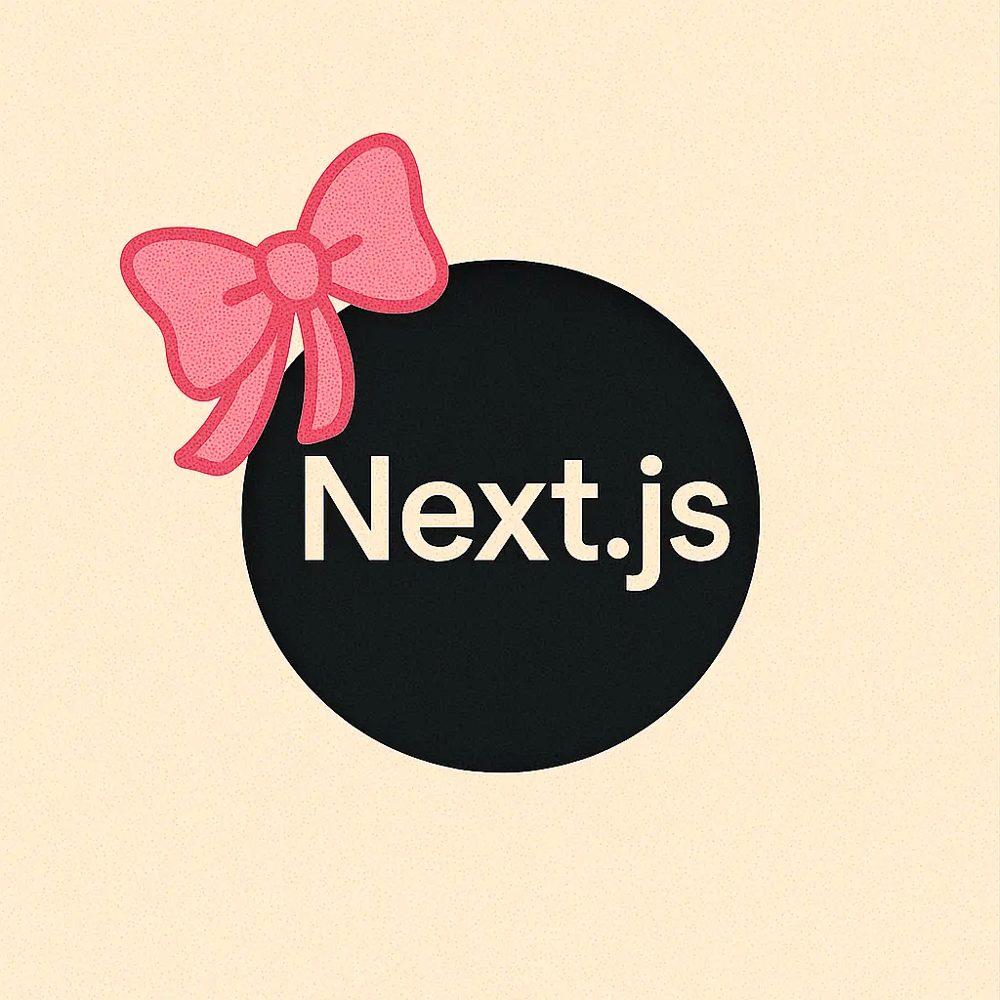

# Hi, I'm Sabrina 🎀 

✨ Fullstack Developer | 3+ years crafting coquette web experiences

  
  
Me during code reviews

---

## 🚀 Tech Stack
Yes, those are AI generated

  
  
  
  
  
  
  
  
  
  
  
  
  
  

---

## 📊 Stats & Activity

---

## 💕 Currently Loving
- 🧪 TDD
- 📚 Learning more about system design and software architectures
- 🧶 Crochet stuffed animals 

---

## 💌 Let’s Connect

